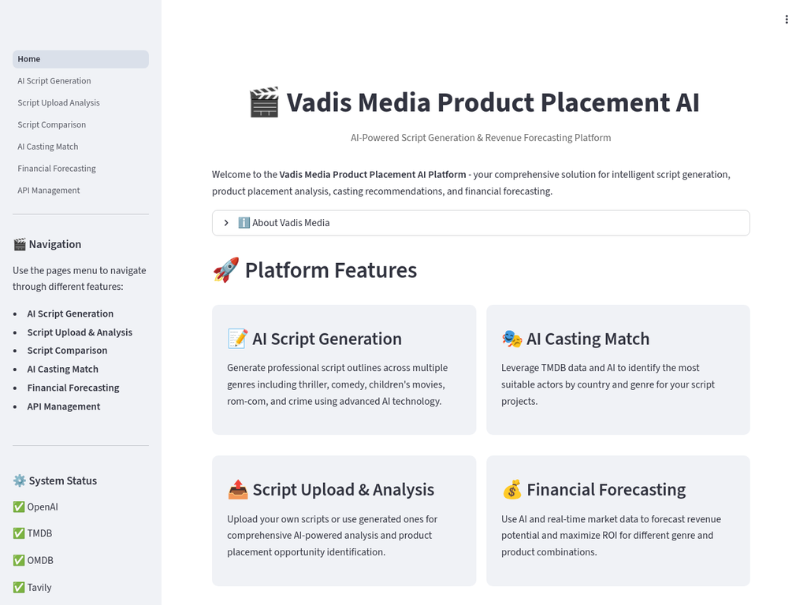
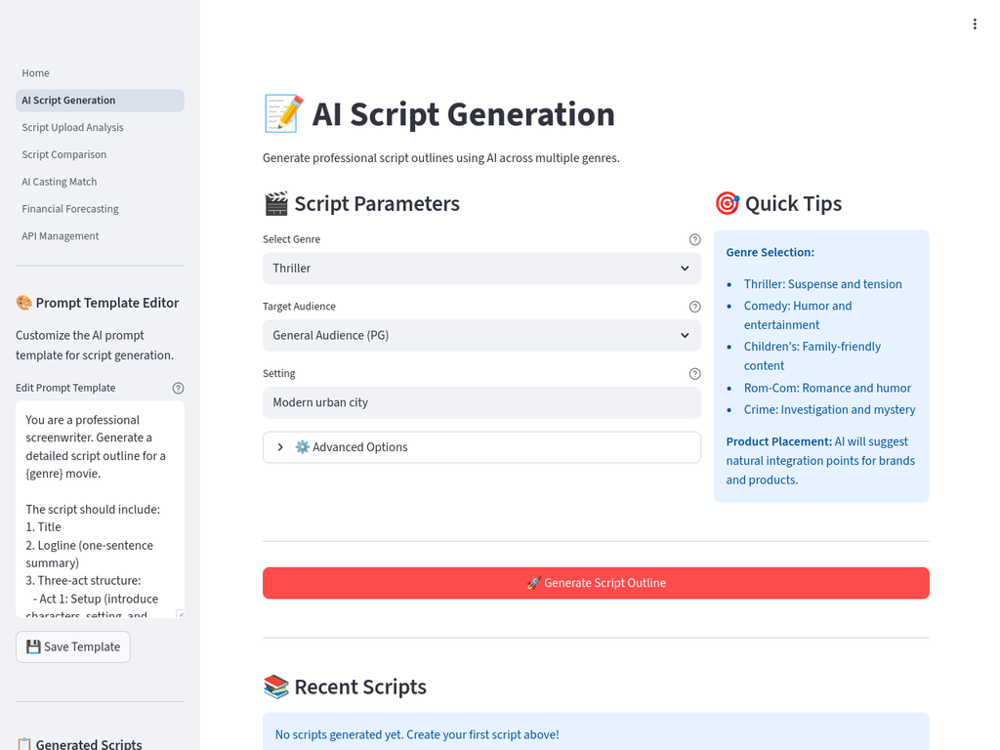
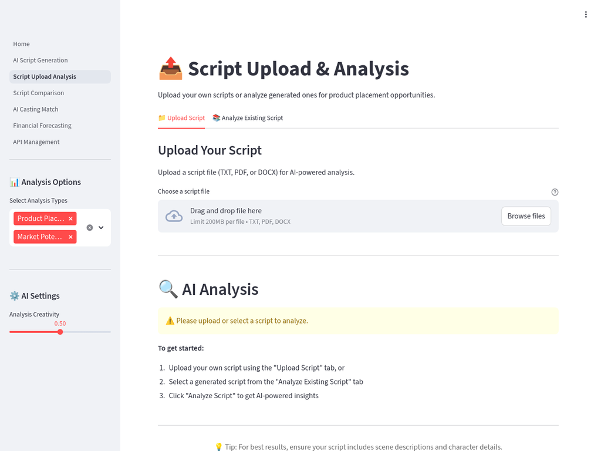
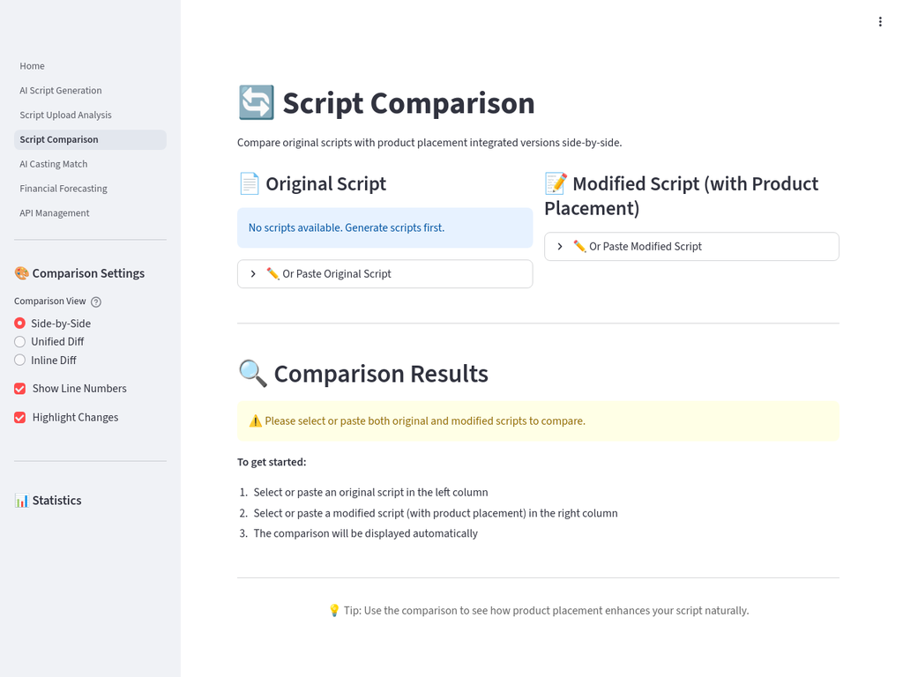
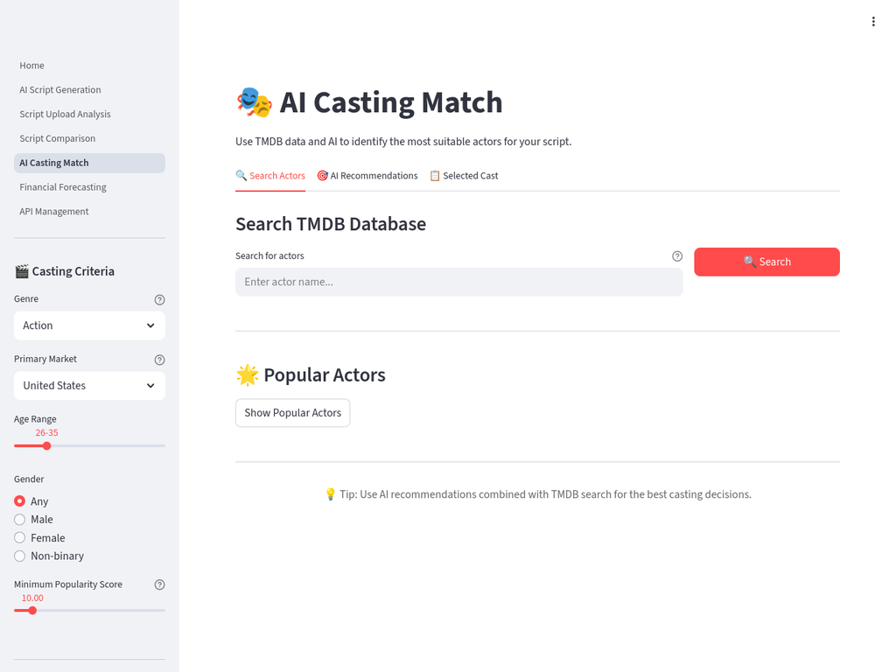

# Vadis Media Product Placement AI - User Guide

## Table of Contents
1. [Introduction](#introduction)
2. [Getting Started](#getting-started)
3. [Features Overview](#features-overview)
4. [AI Script Generation](#ai-script-generation)
5. [Script Upload & Analysis](#script-upload--analysis)
6. [Script Comparison](#script-comparison)
7. [AI Casting Match](#ai-casting-match)
8. [Financial Forecasting](#financial-forecasting)
9. [API Management](#api-management)
10. [Troubleshooting](#troubleshooting)

---

## Introduction

Welcome to the **Vadis Media Product Placement AI Platform** - your comprehensive solution for intelligent script generation, product placement analysis, casting recommendations, and financial forecasting.

This platform leverages cutting-edge AI technology to help you:
- Generate professional script outlines across multiple genres
- Analyze scripts for product placement opportunities
- Find the perfect actors for your projects
- Forecast revenue potential and ROI

---

## Getting Started

### Installation

1. **Clone the repository:**
   ```bash
   git clone https://github.com/kaljuvee/movies-product-placement.git
   cd movies-product-placement
   ```

2. **Create a virtual environment:**
   ```bash
   python3 -m venv .venv
   source .venv/bin/activate  # On Windows: .venv\Scripts\activate
   ```

3. **Install dependencies:**
   ```bash
   pip install -r requirements.txt
   ```

4. **Configure API keys:**
   - Copy `.env.sample` to `.env`
   - Add your API keys:
     ```
     OPENAI_API_KEY=your_openai_key
     TMDB_API_KEY=your_tmdb_key
     TMDB_API_READ_TOKEN=your_tmdb_token
     OMDB_API_KEY=your_omdb_key
     TAVILY_API_KEY=your_tavily_key
     ```

5. **Run the application:**
   ```bash
   streamlit run Home.py
   ```

6. **Access the application:**
   - Open your browser to `http://localhost:8501`

---

## Features Overview



The platform consists of six main features:

1. **AI Script Generation** - Generate professional script outlines
2. **Script Upload & Analysis** - Analyze scripts for opportunities
3. **Script Comparison** - Compare original vs. modified scripts
4. **AI Casting Match** - Find suitable actors using TMDB data
5. **Financial Forecasting** - Forecast revenue and ROI
6. **API Management** - Configure and test API connections

### System Status

The home page displays the status of all integrated APIs:
- ✅ **OpenAI** - AI text generation
- ✅ **TMDB** - Movie database and actor information
- ✅ **OMDB** - Additional movie metadata
- ✅ **Tavily** - Web search and research

---

## AI Script Generation



### Overview

The AI Script Generation feature allows you to create professional script outlines using advanced AI technology. The system supports multiple genres and provides customizable parameters.

### How to Use

1. **Select Genre:**
   - Thriller
   - Comedy
   - Children's Movies
   - Rom-Com
   - Crime

2. **Choose Target Audience:**
   - General Audience (PG)
   - Teen Audience (PG-13)
   - Mature Audience (R)
   - Family (G)

3. **Specify Setting:**
   - Enter the setting for your script (e.g., "Modern urban city", "Medieval castle", "Space station")

4. **Advanced Options (Optional):**
   - **Creativity Level:** Adjust the temperature (0.0-1.0) for more or less creative outputs
   - **Maximum Length:** Set the maximum number of tokens for the generated script

5. **Generate Script:**
   - Click "🚀 Generate Script Outline"
   - Wait for the AI to generate your script
   - Review the generated outline

### Prompt Template Editor

You can customize the AI prompt template to suit your specific needs:

1. Click on the **Prompt Template Editor** in the sidebar
2. Edit the template text
3. Use placeholders: `{genre}`, `{target_audience}`, `{setting}`
4. Click "💾 Save Template" to save your changes

### Generated Scripts

All generated scripts are automatically saved and can be:
- Viewed in the "Recent Scripts" section
- Downloaded for offline use
- Used in the Script Analysis feature
- Compared in the Script Comparison feature

---

## Script Upload & Analysis



### Overview

Upload your own scripts or analyze generated ones to identify product placement opportunities and market potential.

### How to Use

#### Upload Script

1. **Select the "Upload Script" tab**
2. **Choose a file:**
   - Drag and drop your script file
   - Or click "Browse files" to select
   - Supported formats: TXT, PDF, DOCX
   - Maximum file size: 200MB

3. **Configure Analysis Options:**
   - Select analysis types:
     - Product Placement Opportunities
     - Market Potential
     - Character Analysis
     - Scene Breakdown
   - Adjust AI creativity level (0.0-1.0)

4. **Analyze:**
   - Click "Analyze Script"
   - Wait for AI analysis to complete
   - Review the results

#### Analyze Existing Script

1. **Select the "Analyze Existing Script" tab**
2. **Choose a generated script** from the dropdown
3. **Configure analysis options** (same as above)
4. **Click "Analyze Script"**

### Analysis Results

The AI will provide:
- **Product Placement Opportunities:** Natural integration points for brands
- **Market Potential:** Target audience and commercial viability
- **Character Analysis:** Main characters and their roles
- **Scene Breakdown:** Key scenes and their importance

---

## Script Comparison



### Overview

Compare original scripts with product placement integrated versions side-by-side to see how placements enhance your script naturally.

### How to Use

1. **Select Original Script:**
   - Choose from generated scripts dropdown
   - Or paste your original script in the text area

2. **Select Modified Script:**
   - Choose a modified version from the dropdown
   - Or paste your modified script in the text area

3. **Comparison Settings:**
   - **View Mode:**
     - Side-by-Side: View both scripts next to each other
     - Unified Diff: See changes in a unified view
     - Inline Diff: See changes inline with context
   - **Show Line Numbers:** Display line numbers for reference
   - **Highlight Changes:** Highlight added/removed content

4. **Review Comparison:**
   - The comparison will be displayed automatically
   - Added content is highlighted in green
   - Removed content is highlighted in red
   - Unchanged content is shown in default color

### Statistics

The comparison view displays:
- Total lines in original script
- Total lines in modified script
- Number of additions
- Number of deletions
- Percentage of changes

---

## AI Casting Match



### Overview

Leverage TMDB data and AI to identify the most suitable actors for your script projects based on genre, market, and other criteria.

### How to Use

#### Search Actors

1. **Enter actor name** in the search box
2. **Click "🔍 Search"**
3. **Review results:**
   - Actor photo
   - Name and popularity score
   - Known for (movies/shows)
   - Biography
   - Add to cast button

#### Browse Popular Actors

1. **Click "Show Popular Actors"**
2. **Filter by:**
   - **Genre:** Action, Comedy, Drama, Horror, Romance, Sci-Fi, Thriller
   - **Primary Market:** United States, United Kingdom, France, Germany, etc.
   - **Age Range:** 18-80 years
   - **Gender:** Any, Male, Female, Non-binary
   - **Minimum Popularity Score:** 0-100

3. **Review results** and add actors to your cast

#### AI Recommendations

1. **Click "🎯 AI Recommendations" tab**
2. **Provide script details:**
   - Genre
   - Target audience
   - Budget range
   - Character descriptions

3. **Click "Get AI Recommendations"**
4. **Review AI-suggested actors** with reasoning

#### Selected Cast

1. **Click "📋 Selected Cast" tab**
2. **View all selected actors**
3. **Export cast list** as PDF or CSV
4. **Remove actors** if needed

---

## Financial Forecasting


### Overview

Use AI and real-time market data to forecast revenue potential and maximize ROI for different genre and product combinations.

### How to Use

#### Revenue Forecast

1. **Set Forecast Parameters:**
   - **Movie Genre:** Action, Comedy, Drama, Horror, Romance, Sci-Fi, Thriller
   - **Production Budget:** $5M-$20M (slider)
   - **Target Markets:** Select one or more markets
   - **Product Category:** Technology, Automotive, Fashion, Food & Beverage, etc.
   - **Number of Placements:** 1-20

2. **Configure Advanced Settings:**
   - **Expected Audience:** Estimated viewers in millions
   - **Average Ticket Price:** Price in USD
   - **Avg Placement Fee per Product:** Fee in thousands USD

3. **Review Quick Metrics:**
   - **Est. Box Office:** Estimated box office revenue
   - **Placement Revenue:** Revenue from product placements
   - **Total Revenue:** Combined revenue

4. **Generate Detailed Forecast:**
   - Click "🚀 Generate Detailed Forecast"
   - Wait for AI analysis
   - Review detailed breakdown

#### ROI Analysis

1. **Click "🎯 ROI Analysis" tab**
2. **Review ROI calculations:**
   - Return on Investment percentage
   - Break-even analysis
   - Risk assessment
   - Profitability timeline

#### Market Insights

1. **Click "📊 Market Insights" tab**
2. **Review market data:**
   - Genre performance trends
   - Product category effectiveness
   - Regional market analysis
   - Competitive landscape

---

## API Management


### Overview

Configure, test, and manage all external API integrations used by the platform.

### How to Use

#### View API Status

The API Management page displays the status of all configured APIs:
- ✅ **OpenAI** - AI text generation
- ✅ **TMDB** - Movie database
- ✅ **OMDB** - Movie metadata
- ✅ **Tavily** - Web search

#### Test API Connections

1. **Select an API** by clicking its button
2. **Review configuration:**
   - API key status (masked for security)
   - Available features
   - Documentation links

3. **Click "Test [API Name]"** to test the connection
4. **Review test results:**
   - Success/failure status
   - Response time
   - Error messages (if any)

#### Update API Keys

1. **Click "📝 Update API Keys"** to expand the section
2. **Follow the instructions:**
   - Edit the `.env` file in the project root
   - Add or update API keys
   - Restart the Streamlit application

3. **Test the updated API** to confirm it works

#### Refresh All Status

Click "🔄 Refresh All Status" to test all API connections at once and update their status indicators.

---

## Troubleshooting

### Common Issues

#### Application Won't Start

**Problem:** Streamlit fails to start or shows errors

**Solutions:**
1. Ensure all dependencies are installed:
   ```bash
   pip install -r requirements.txt
   ```

2. Check Python version (requires Python 3.8+):
   ```bash
   python --version
   ```

3. Verify virtual environment is activated:
   ```bash
   source .venv/bin/activate  # On Windows: .venv\Scripts\activate
   ```

#### API Connection Errors

**Problem:** APIs show as failed or unavailable

**Solutions:**
1. Verify API keys in `.env` file
2. Check internet connection
3. Test individual APIs in API Management page
4. Review API usage limits and quotas

#### Script Generation Fails

**Problem:** AI script generation returns errors

**Solutions:**
1. Check OpenAI API key is valid
2. Verify OpenAI account has sufficient credits
3. Try reducing the maximum token length
4. Check the prompt template for syntax errors

#### File Upload Issues

**Problem:** Cannot upload scripts for analysis

**Solutions:**
1. Verify file format (TXT, PDF, or DOCX)
2. Check file size (must be under 200MB)
3. Ensure file is not corrupted
4. Try converting to plain text format

#### Database Errors

**Problem:** Database-related errors appear

**Solutions:**
1. Check if `vadis_media.db` exists in the project root
2. Reinitialize the database:
   ```bash
   sqlite3 vadis_media.db < sql/schema.sql
   ```

3. Verify file permissions

### Getting Help

If you encounter issues not covered in this guide:

1. **Check the logs:**
   - Streamlit logs appear in the terminal
   - Check `streamlit.log` if running in background

2. **Review test results:**
   - Run test scripts in the `tests/` directory
   - Check `test-results/` for detailed test outputs

3. **Contact Support:**
   - Email: support@vadis-media.com
   - GitHub Issues: [Create an issue](https://github.com/kaljuvee/movies-product-placement/issues)

---

## Best Practices

### Script Generation
- Use specific, detailed settings for better results
- Experiment with different creativity levels
- Save and iterate on generated scripts
- Review and edit AI-generated content

### Product Placement
- Identify natural integration points
- Ensure placements align with story and characters
- Balance commercial and creative goals
- Test audience reactions to placements

### Casting
- Use multiple search methods (search, browse, AI recommendations)
- Consider actor popularity and market fit
- Review actor filmography for genre experience
- Balance star power with budget constraints

### Financial Forecasting
- Use realistic budget and audience estimates
- Consider multiple market scenarios
- Update forecasts as project evolves
- Compare with similar genre/budget films

---

## Appendix

### Supported File Formats

| Format | Extension | Max Size | Notes |
|--------|-----------|----------|-------|
| Plain Text | .txt | 200MB | Recommended for scripts |
| PDF | .pdf | 200MB | Automatically extracted |
| Word Document | .docx | 200MB | Formatting may be lost |

### API Rate Limits

| API | Free Tier | Paid Tier | Notes |
|-----|-----------|-----------|-------|
| OpenAI | Varies | Varies | Based on model and usage |
| TMDB | 40 req/10s | N/A | Free for non-commercial use |
| OMDB | 1000 req/day | Unlimited | Paid tier available |
| Tavily | Varies | Varies | Contact for details |

### Keyboard Shortcuts

| Shortcut | Action |
|----------|--------|
| `Ctrl + R` | Refresh page |
| `Ctrl + S` | Save current work |
| `Ctrl + /` | Toggle sidebar |

---

## Changelog

### Version 1.0.0 (2025-10-31)
- Initial release
- AI Script Generation feature
- Script Upload & Analysis feature
- Script Comparison feature
- AI Casting Match feature
- Financial Forecasting feature
- API Management feature

---

## License

Copyright © 2025 Vadis Media. All rights reserved.

---

## Acknowledgments

This platform is powered by:
- **OpenAI** - AI text generation
- **LangChain** - LLM orchestration
- **Streamlit** - Web application framework
- **TMDB** - Movie database
- **OMDB** - Movie metadata
- **Tavily** - Web search

---

*For more information, visit [vadis-media.com](https://vadis-media.com)*
